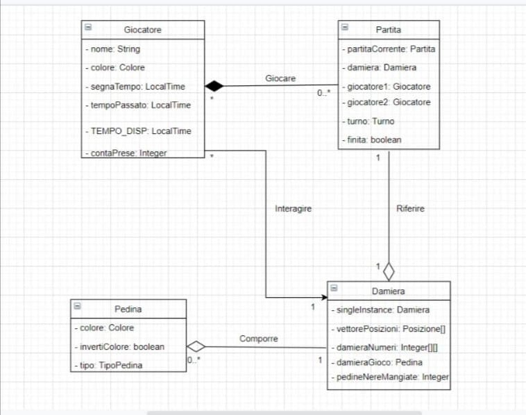
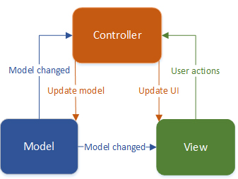
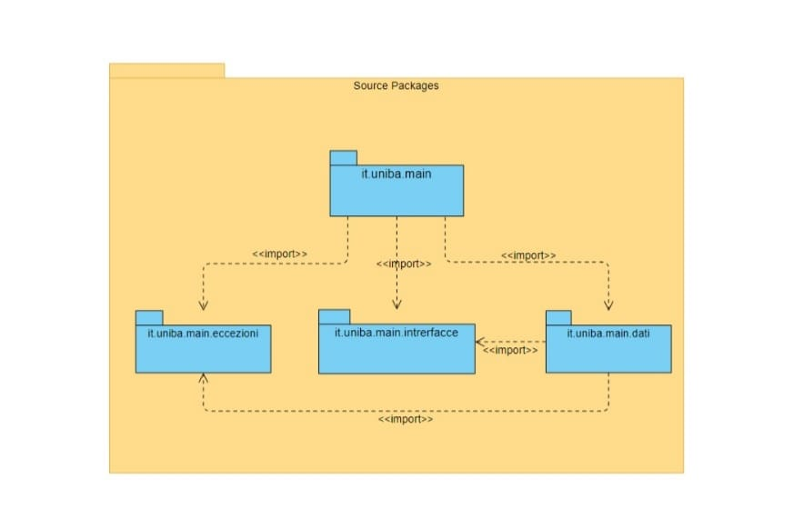
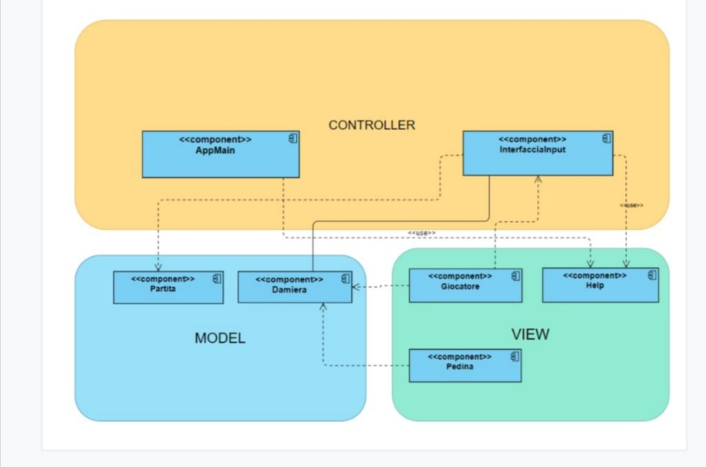
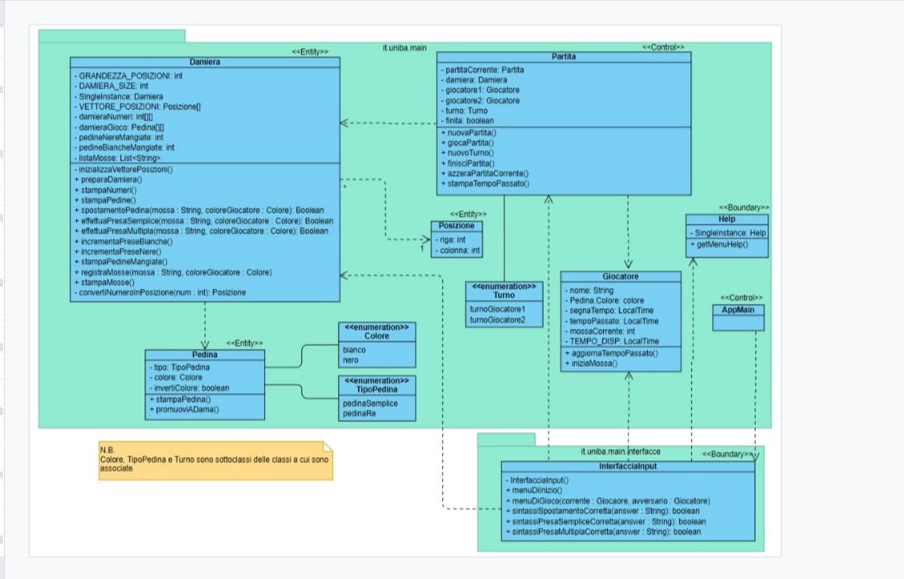
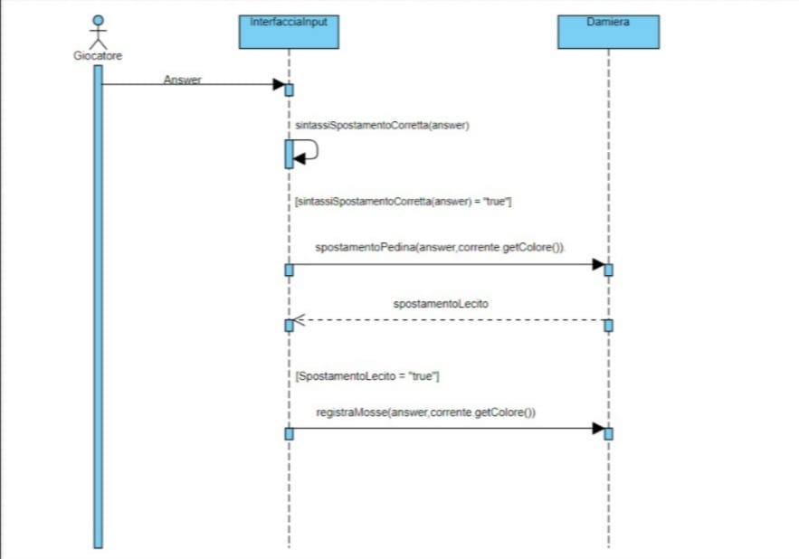
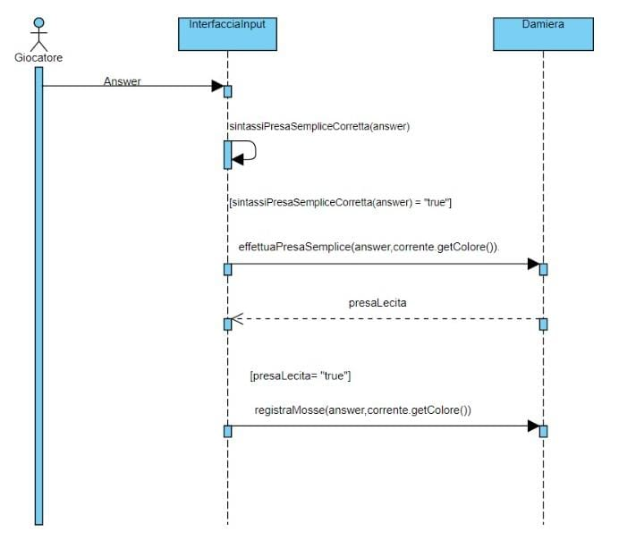
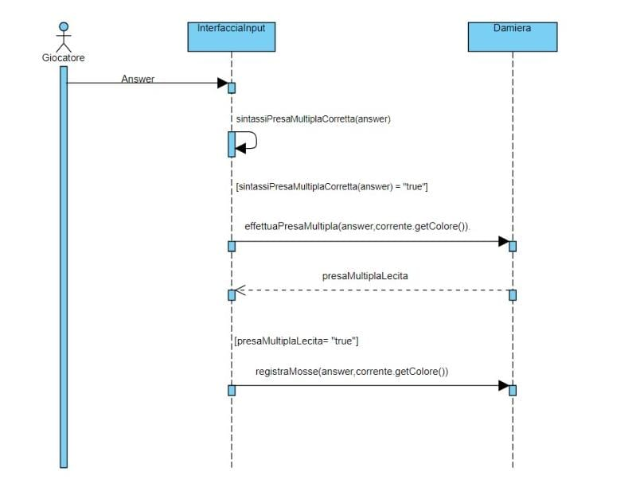
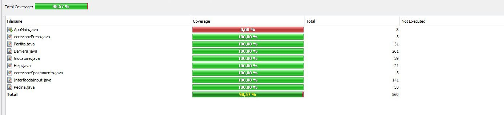

#  **Relazione tecnica finale**


## **0. Indice**

[**1. Introduzione**](#**1.-Introduzione**) 

[**2. Modello di dominio**](#**2.-Modello-di-dominio**) 

[**3. Requisiti specifici**](#**3.-Requisiti-specifici**) 

[**4. System Design**](#**4.-System-Design**) 

[**5. OO Design**](#**5.-OO-Design**) 

[**6. Riepilogo del test**](#**6.-Riepilogo-del-test**) 

[**7. Manuale Utente**](#**7.-Manuale-utente**) 

[**8. Processo di sviluppo e organizzazione del lavoro**](#**8.-Processo-di-sviluppo-e-organizzazione-del-lavoro**) 

[**9. Analisi retrospettiva**](#**9.-Analisi-retrospettiva**) 


## **1. Introduzione**

**Dama italiana** è un' applicazione che vuole simulare il gioco della dama italiana, con interfaccia a linea di comando (CLI).
L'applicazione consente all'utente di affrontare un altro giocatore (dalla stessa macchina), offrendo anche la possibilità di visualizzare in ogni momento:
-la damiera numerata
-la damiera aggiornata dopo ogni mossa\presa
-l'elenco delle prese effettuate
-l'elenco delle mosse effettuate
-il tempo passato per ciascun giocatore
( per maggiori informazioni leggere  [**7. Manuale Utente**](#**7.-Manuale-utente**) )


## **2. Modello di dominio**

Di seguito si riporta il modello di dominio (diagramma delle classi con prospettiva concettuale)




## **3. Requisiti specifici**

Per la realizzazione di questa applicazione vengono forniti i seguenti requisiti funzionali:
- In qualità di utente si vuole visualizzare l'help con l'elenco dei comandi
- In qualità di utente si vuole iniziare una nuova partita
- In qualità di utente si vuole abbandonare la partita
- In qualità di utente si vuole chiudere il gioco
- In qualità di utente si vuole mostrare la damiera con la numerazione in modo da ricordare come sono numerate le caselle della damiera
- In qualità di utente si vuole mostrare la damiera con i pezzi in modo da visualizzare lo stato del gioco
- In qualità di utente si vuole mostrare il tempo di gioco
- In qualità di utente si vuole spostare una pedina mediante spostamento semplice
- In qualità di utente si vuole spostare una pedina con presa semplice
- In qualità di utente si vuole spostare una pedina con presa multipla
- In qualità di utente si vuole spostare una pedina con damatura
- In qualità di utente si vuole visualizzare le prese in modo di valutare se in caso di offrire una patta o abbandonare
- In qualità di utente si vuole visualizzare le mosse giocate in modo da poter ripercorrere mentalmente la storia della partita giocata

I requisiti non funzionali sono i seguenti:
- La copertura dei test automatici prodotto da Coveralls deve essere al 100%
- Risoluzione di tutti gli errori generati da un' analisi statica del codice (uso di Spotbugs)
- Concordare un sottoinsieme ragionevole comune di regole di codifica e quindi utilizzare uno strumento automatizzato per applicarle automaticamente (uso di Checkstyle)


## **4. System Design**

### Stile architetturale adottato

Lo stile architetturale adottato è il MVC (Model-View-Controller).
Il pattern è basato sulla separazione dei compiti fra i componenti software che interpretano tre ruoli principali:

- il model fornisce i metodi per accedere ai dati utili all'applicazione;
- il view visualizza i dati contenuti nel model e si occupa dell'interazione con utenti e agenti;
- il controller riceve i comandi dell'utente (in genere attraverso il view) e li attua modificando lo stato degli altri due componenti;




### Diagramma dei package

Di seguito si riporta il diagramma dei packege




### Diagramma dei componenti

Di seguito si riporta il diagramma dei componenti applicato allo stile architetturale MVC



### Commento
La scelta dello stile architetturale è ricaduta sul modello MVC poiché, per l' applicazione richiesta, tale stile risulta più adeguato. Infatti risulta intuitivo suddivedere le classi utilizzate nella realizzazione dell' applicazione tra i vari moduli di cui il modello MVC è formato.


## **5. OO Design**


### Diagrammi delle classi e diagrammi di sequenza




*Diagramma delle classi con prospettiva software



*Diagramma di sequenza relativo allo spostamento semplice di una pedina



*Diagramma di sequenza relativo alla presa semplice



*Diagramma di sequenza relativo alla presa multipla

### Commento
Di seguito si riportano ulteriori dettagli sulle scelte progettuali:

- La Damiera è un'entità singleton, è stata presa questa scelta in quanto ,come partita, può essere in esecuzione solamente una damiera per volta;
- La presa multipla è stata pensata come una sequenza di prese semplici, una volta che la stringa di comando viene esaminata viene divisa in n token che sono le singole prese semplici da eseguire, il metodo "presaMultipla" prima di eseguire le prese semplici crea una damiera di backup che serve per un restore della damiera nel caso in cui una delle n prese semplici non sia lecita; 
- Il metodo metodo utilizzato per tradurre il comando di un utente per eseguire una mossa, consiste nell'utilizzare un array per la traduzione. Nella damiera ci sono caselle che hanno un numero identificativo (da 1 a 32), essa è una matrice 8x8 e quindi non potendo riconoscere questi numeri abbiamo creato un array di posizioni (di 32 elementi) e in corrispondenza della posizione (i-1)-esima abbiamo la posizione corrispettiva all'interno della matrice;


## **6. Riepilogo del test**

Si riporta, di seguito, la tabella riassuntiva di Coveralls, con dati sul numero dei casi di test e copertura del codice.



## **7. Manuale utente**

Per eseguire il programma occorre scaricare l’immagine da docker.com ed eseguire il container mediante l’installazione locale di Docker (Per l'installazione di Docker: <https://www.docker.com/get-started>).

Si svolgano le seguenti operazioni:

- avviare Docker localmente (una volta aperta l’applicazione, bisogna attendere che nel menu di Docker compaia la scritta “Docker is running”)

- se si utilizza Windows selezionare `Switch to Linux containers` nel menu di Docker

- digitare nel terminale il seguente comando:

  ```
    docker pull  docker.pkg.github.com/softeng2021-inf-uniba/progetto2021bis-gosling/dama-gosling:latest                   
  ```
  Attendere che Docker scarichi l’immagine dell’applicazione.

- digitare il comando:

  ```
    docker run --rm -it docker.pkg.github.com/softeng2021-inf-uniba/progetto2021bis-gosling/dama-gosling:latest
  ```

L’applicazione verrà eseguita in un container sul computer locale. È possibile  passare parametri aggiungendo stringhe in coda al comando. Per esempio:
docker run --rm -it docker.pkg.github.com/softeng2021-inf-uniba/progetto2021bis-gosling/dama-gosling:latest "--help"
docker run --rm -it docker.pkg.github.com/softeng2021-inf-uniba/progetto2021bis-gosling/dama-gosling:latest "-h"


**N.B.:**

l’opzione `—-rm` serve per far sì che docker fermi l’esecuzione del container nel momento in cui l’applicazione eseguita al suo interno termina.


## **8. Processo di sviluppo e organizzazione del lavoro**

Per strutturare lo sviluppo del software è stato utilizzato il metodo di sviluppo agile Scrum.

Il processo è stato suddiviso in 4 sprint:

- #### Sprint 0

  **Inizio**: 23 marzo

  **Fine**: 30 aprile

  **Feedback**: 6 aprile

  **Obiettivo**: dimostrare familiarità con la toolchain e il processo agile

  **Definition of done**:
    Caricare le modifiche successive alla creazione dei repository degli studenti, auto-assegnando task individuali che dovranno essere completati seguendo il GitHub Flow.
    
    Criteri che devono essere soddisfatti per qualsiasi user story:

  - C'è un issue con label «user story»
  - La issue è in una Milestone e in una Project Board
  - Assegnazione a uno o al più due componenti del team
  - commit devono avere una descrizione significativa
  - C'è una Pull Request (PR) che corrisponde alla user story
  - C'è un commento che linka la PR all'issue (es. "closes #22")
    La PR è accettata a review avvenuto ed esplicito
  - Build costruito con successo
  - Docker image caricata con successo
  - L'esecuzione rispetta i criteri di accettazione 
 
  

- #### Sprint 1

  **Inizio**: 6 aprile

  **Fine**: 18 aprile

  **Feedback**: 23 aprile

  **Obiettivo**: Creare le basi per il gioco della dama

  **User Story**:

  - Mostrare l'help con l'elenco dei comandi
  - Iniziare una nuova partita
  - Abbandonare la partita
  - Chiudere il gioco 
  - Mostrare la damiera con la numerazione  in modo da ricordare come sono numerate le caselle della damiera
  - Mostrare la damiera con i pezzi in modo da visualizzare lo stato del gioco
  - Mostrare il tempo di gioco

  **Definition of done**:
- Eseguendo il comando help o invocando l'app con flag --help o -h il risultato è una descrizione concisa, che normalmente appare all'avvio del programma, seguita dalla lista di comandi disponibili

- Al comando gioca

se nessuna partita è in corso l'app si predispone a ricevere la prima mossa di gioco o altri comandi

- Al comando abbandona

l'app chiede conferma
se la conferma è positiva, l'app comunica che il Bianco (o Nero) ha vinto per abbandono
se la conferma è negativa, l'app si predispone a ricevere nuovi comandi

- Al comando esci

L'applicazione chiede conferma
se la conferma è psotiva l'app si chiude restituendo un zero exit code
se la conferma è negativa, l'app si predispone a ricevere nuovi comandi

- Al comando numeri

l'app mostra la damiera con i numeri sulle caselle nere.

- Al comando damiera

se il gioco è iniziato l'app mostra la posizione di tutti i pezzi sulla damiera
i pezzi sono mostrati in formato unicode 
se il gioco non è iniziato l'app suggerisce il comando gioca

- Al comando tempo

se il gioco è in corso
l'app mostra il tempo trascorso per il Bianco dall'inizio del gioco
l'app mostra il tempo trascorso per il Nero dall'inizio del gioco
se il gioco non è in corso l'app suggerisce il comando gioca e si predispone a ricevere nuovi comandi
Il valore di default è di 30 minuti a testa


  

- #### Sprint 2

  **Inizio**: 23 aprile

  **Fine**: 6 maggio

  **Feedback**: 13 maggio

  **Obiettivo**: Iniziare e concludere una partita

  **User Story**:

 - Spostare una pedina mediante spostamento semplice
 - Spostare una pedina con presa semplice
 - Spostare una pedina con presa multipla
 - Spostare una pedina con damatura
 - Mostrare le prese
 - Mostrare le mosse giocate

  **Definition of done**:

 - A partita in corso di gioco, l'app deve accettare mosse di spostamento semplice in pedina in notazione algebrica. Es. 1-5
 Lo spostamento semplice della pedina deve rispettare le regole del gioco della dama italiana, escludendo damature e prese.

 - A partita in corso di gioco, l'app deve accettare mosse di spostamento di pedina con presa semplice in notazione algebrica. Es. 18x11
Lo spostamento della pedina con presa semplice deve rispettare le regole del gioco della dama italiana.

- A partita in corso di gioco, l'app deve accettare mosse di spostamento di pedina con presa multipla in notazione algebrica. Es (22x15x6)
Lo spostamento della pedina con presa multipla deve rispettare le regole del gioco della dama italiana.

- A partita in corso di gioco, l'app deve accettare mosse di spostamento di pedina in notazione algebrica che terminano con damatura. Es. 6-3, oppure se c'è presa 10x3
Lo spostamento della pedina con damatura deve rispettare le regole del gioco della dama italiana.

- Al comando prese l'app mostra le prese del Bianco e del Nero con caratteri Unicode.

- Al comando mosse l'app mostra la storia delle mosse con notazione algebrica.


- #### Sprint 3

  **Inizio**: 14 maggio

  **Fine**: 4 giugno

  **Feedback**: dal 7 al 18 giugno

  **Obiettivo**: Comunicare la qualità del lavoro svolto

  **Definition of done**: 

  - Le responsabilità delle classi e la classificazione ECB sono riportati come come commenti Javadoc
  - Sono stati creati i casi di test automatici
  - Sono stati risolti i problemi segnalati da CheckStyle
  - Sono stati risolti i problemi segnalati da Findbugs
  - Sono stati applicati i principi di OO design
  - E' stata completata la relazione tecnica


### Ruoli

​	**Team di sviluppo** ( 5 componenti ) : Pasquale Moniello,  Massimo Tubito, Domenico Vicenti, Francesco Vignola, Giuseppe Volpe.

​	**Product Owner** : prof. Filippo Lanubile

​	**Scrum Master** : prof. Filippo Lanubile


### Scrum board

E' stata usata una board digitale con gli stati: *To do, In progress, Review, Ready, Done* (presente sul repository GitHub). 

### Sprint Backlog

All'inizio di ogni Sprint il gruppo si è riunito per la discussione delle user story , definendone un design preliminare e identificando i task.


### Daily scrum meeting

Quando possibile, si sono organizzati *daily scrum meeting*  ai quali hanno partecipato tutti i membri del team. Questi meeting si sono tenuti, per necessità, attraverso un' applicazione di teleconferenza (Discord). In ogni incontro ogni componente del team ha risposto a 3 domande:

1. Cosa hai fatto ieri?

2. Cosa farai oggi?

3. Ci sono problemi?

   

### Sprint review

Le review si sono svolte in modo telematico, usando applicazioni come teams o discord.


## **9. Analisi retrospettiva**

1. #### Cosa ci ha fatto sentire soddisfatti

   Ci siamo sentiti molto soddisfatti di questo progetto, che ci ha insegnato a lavorare in modo organico e sincronizzato all'interno di un team, a pianificare il lavoro di sviluppo e a trovare soluzioni migliori ad alcuni problemi che si incontrano durante la progettazione e lo sviluppo di un  software.

   

2. #### Cosa ci ha fatto sentire insoddisfatti

   Ci ha resi insoddisfatti il non aver avuto una conoscenza di base adeguata del linguaggio java che non ha consentito uno sviluppo migliore dell'applicazione.

   Ci sarebbe inoltre piaciuto poter sviluppare un' interfaccia grafica per una più agevole interazione con l'utente, rendendo più realistico il gioco della dama.

3. #### Cosa ci ha fatto «impazzire»
  
   Ci ha fatto "impazzire" la correzione degli errori generati da checkstyle dovuti principalmente alla spaziatura.
   


