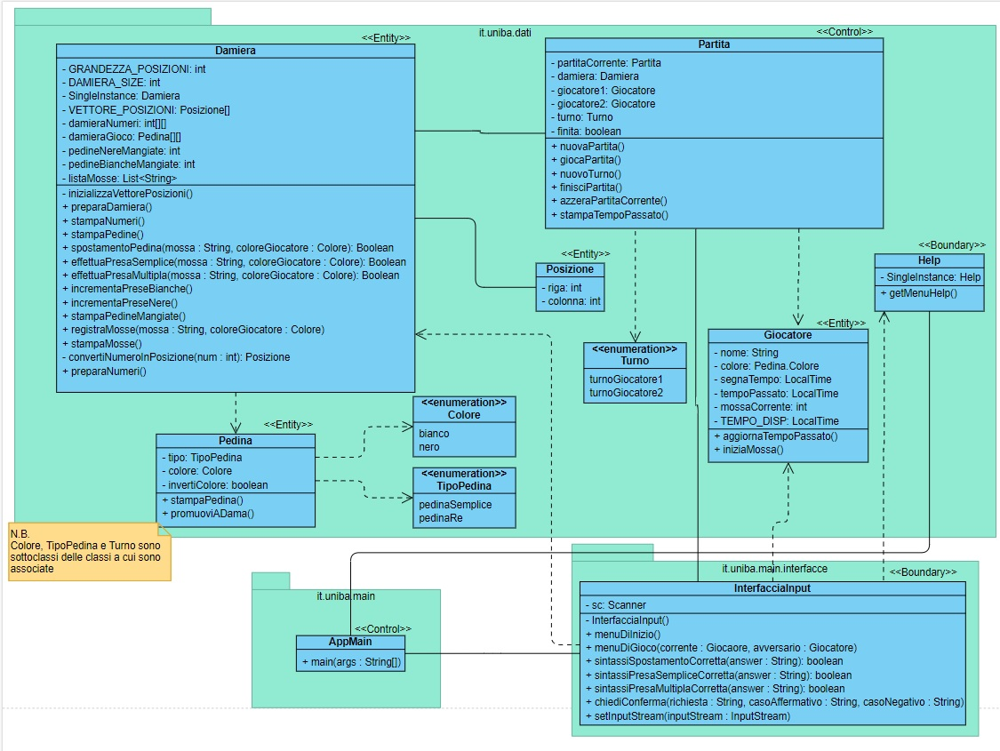

#  **Relazione tecnica finale**

## **0. Indice**

[**1. Introduzione**](#**1.-Introduzione**) 

[**2. Modello di dominio**](#**2.-Modello-di-dominio**) 

[**3. Requisiti specifici**](#**3.-Requisiti-specifici**) 

[**4. System Design**](#**4.-System-Design**) 

[**5. OO Design**](#**5.-OO-Design**) 

[**6. Riepilogo del test**](#**6.-Riepilogo-del-test**) 

[**7. Manuale Utente**](#**7.-Manuale-utente**) 

[**8. Processo di sviluppo e organizzazione del lavoro**](#**8.-Processo-di-sviluppo-e-organizzazione-del-lavoro**) 

[**9. Analisi retrospettiva**](#**9.-Analisi-retrospettiva**) 

## **1. Introduzione**

**Dama italiana** è un' applicazione che vuole simulare il gioco della dama italiana, con interfaccia a linea di comando (CLI).
L'applicazione consente all'utente di affrontare un altro giocatore (dalla stessa macchina), offrendo anche la possibilità di visualizzare in ogni momento:
-la damiera numerata
-la damiera aggiornata dopo ogni mossa\presa
-l'elenco delle prese effettuate
-l'elenco delle mosse effettuate
-il tempo passato per ciascun giocatore
( per maggiori informazioni leggere  [**7. Manuale Utente**](#**7.-Manuale-utente**) )

## **2. Modello di dominio**

Di seguito si riporta il modello di dominio (diagramma delle classi con prospettiva concettuale)

## **3. Requisiti specifici**

Per la realizzazione di questa applicazione vengono forniti i seguenti requisiti funzionali:
- In qualità di utente si vuole visualizzare l'help con l'elenco dei comandi
- In qualità di utente si vuole iniziare una nuova partita
- In qualità di utente si vuole abbandonare la partita
- In qualità di utente si vuole chiudere il gioco
- In qualità di utente si vuole mostrare la damiera con la numerazione in modo da ricordare come sono numerate le caselle della damiera
- In qualità di utente si vuole mostrare la damiera con i pezzi in modo da visualizzare lo stato del gioco
- In qualità di utente si vuole mostrare il tempo di gioco
- In qualità di utente si vuole spostare una pedina mediante spostamento semplice
- In qualità di utente si vuole spostare una pedina con presa semplice
- In qualità di utente si vuole spostare una pedina con presa multipla
- In qualità di utente si vuole spostare una pedina con damatura
- In qualità di utente si vuole visualizzare le prese in modo di valutare se in caso di offrire una patta o abbandonare
- In qualità di utente si vuole visualizzare le mosse giocate in modo da poter ripercorrere mentalmente la storia della partita giocata

I requisiti non funzionali sono i seguenti:
- La copertura dei test automatici prodotto da Coveralls deve essere al 100%
- Risoluzione di tutti gli errori generati da un' analisi statica del codice (uso di Spotbugs)
- Concordare un sottoinsieme ragionevole comune di regole di codifica e quindi utilizzare uno strumento automatizzato per applicarle automaticamente (uso di Checkstyle)

## **4. System Design**

### Stile architetturale adottato

Lo stile architetturale adottato è il MVC (Model-View-Controller).
Il pattern è basato sulla separazione dei compiti fra i componenti software che interpretano tre ruoli principali:

- il model fornisce i metodi per accedere ai dati utili all'applicazione;
- il view visualizza i dati contenuti nel model e si occupa dell'interazione con utenti e agenti;
- il controller riceve i comandi dell'utente (in genere attraverso il view) e li attua modificando lo stato degli altri due componenti;

### Diagramma dei package

Di seguito si riporta il diagramma dei packege

### Diagramma dei componenti

Di seguito si riporta il diagramma dei componenti applicato allo stile architetturale MVC

### Commento
La scelta dello stile architetturale è ricaduta sul modello MVC poiché, per l' applicazione richiesta, tale stile risulta più adeguato. Infatti risulta intuitivo suddivedere le classi utilizzate nella realizzazione dell' applicazione tra i vari moduli di cui il modello MVC è formato.

## **5. OO Design**

### Diagrammi delle classi e diagrammi di sequenza

*Diagramma delle classi con prospettiva software

*Diagramma di sequenza relativo allo spostamento semplice di una pedina

*Diagramma di sequenza relativo alla presa semplice

*Diagramma di sequenza relativo alla presa multipla

### Commento
Di seguito si riportano ulteriori dettagli sulle scelte progettuali:

- La Damiera è un'entità singleton, è stata presa questa scelta in quanto ,come partita, può essere in esecuzione solamente una damiera per volta;
- La presa multipla è stata pensata come una sequenza di prese semplici, una volta che la stringa di comando viene esaminata viene divisa in n token che sono le singole prese semplici da eseguire, il metodo "presaMultipla" prima di eseguire le prese semplici crea una damiera di backup che serve per un restore della damiera nel caso in cui una delle n prese semplici non sia lecita; 
- Il metodo metodo utilizzato per tradurre il comando di un utente per eseguire una mossa, consiste nell'utilizzare un array per la traduzione. Nella damiera ci sono caselle che hanno un numero identificativo (da 1 a 32), essa è una matrice 8x8 e quindi non potendo riconoscere questi numeri abbiamo creato un array di posizioni (di 32 elementi) e in corrispondenza della posizione (i-1)-esima abbiamo la posizione corrispettiva all'interno della matrice;

## **6. Riepilogo del test**

Si riporta, di seguito, la tabella riassuntiva di Coveralls, con dati sul numero dei casi di test e copertura del codice.
